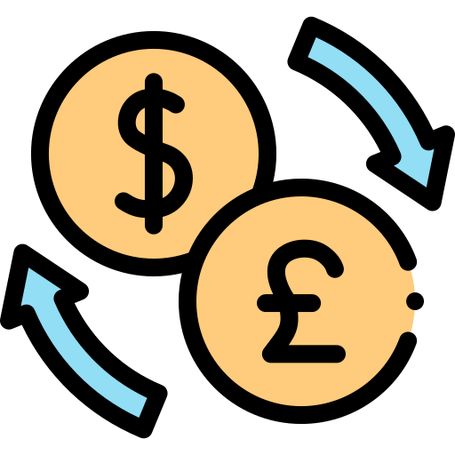
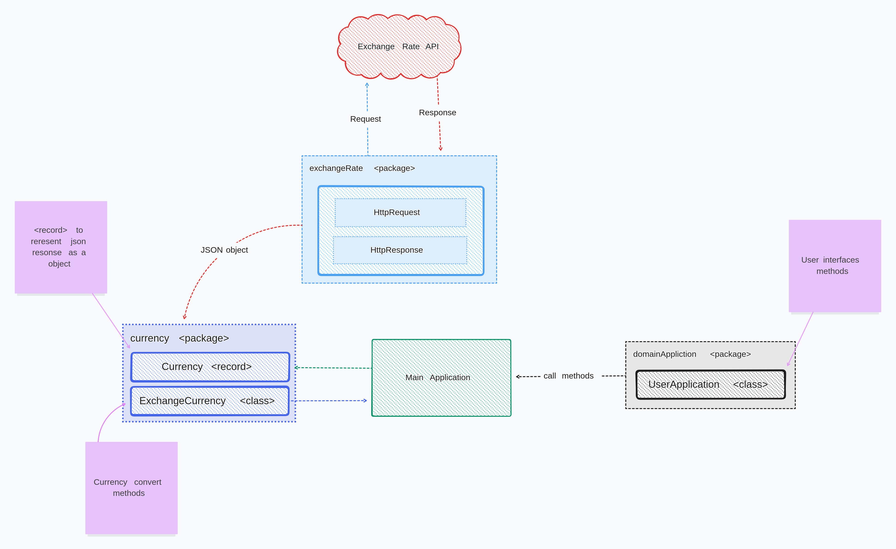

<a name="currency-converter">
    
</a>

[![Contributors][contributors-shield]][contributors-url]
[![Forks][forks-shield]][forks-url]
[![Stargazers][stars-shield]][stars-url]
[![personal][personal-shield]][personal-url]
[![Issues][issues-shield]][issues-url]
[![LinkedIn][linkedin-shield]][linkedin-url]


<!-- PROJECT LOGO -->

<br />
<div align="center">
   <a href="https://github.com/luk3mn/spotify-profile">
    
  </a>

  <h3 align="center">Currency Converter</h3>

  <p align="center">
    Challenge ONE: Exchange currency built in java to request an API currency in order to convert it.
    <br />
    <a href="https://github.com/luk3mn/currency-converter/README.md"><strong>Explore the docs »</strong></a>
    <br />
    <br />
  </p>
</div>


<!-- TABLE OF CONTENTS -->
<details>
  <summary>Table of Contents</summary>
  <ol>
    <li>
      <a href="#about-the-project">About The Project</a>
      <ul>
        <li><a href="#built-with">Built With</a></li>
      </ul>
    </li>
    <li>
      <a href="#getting-started">Getting Started</a>
      <ul>
        <li><a href="#prerequisites">Prerequisites</a></li>
        <li><a href="#installation">Installation</a></li>
      </ul>
    </li>
    <li><a href="#usage">Usage</a></li>
    <!-- <li><a href="#deploy">Deploy</a></li> -->
    <li><a href="#roadmap">Roadmap</a></li>
    <li><a href="#license">License</a></li>
    <li><a href="#authors">Authors</a></li>
    <li><a href="#feedback">Feedback</a></li>
    <li><a href="#acknowledgments">Acknowledgments</a></li>
  </ol>
</details>


<!-- ABOUT THE PROJECT -->
## About The Project
<!-- IMAGE (OPCIONAL) -->


<p align="justify">
Currency exchange application to provide exchange options for users (by console) by using <a href="https://www.exchangerate-api.com/">Exchange Rate API</a> in order to provide data in real-time to use into application.
</p> 

<p align="right">(<a href="#currency-converter">back to top</a>)</p>

### Built With

Write here

[//]: # (* [![Python][Python]][Python-url])

[//]: # (* [![Flask][Flask]][Flask-url])
* [![Java][Java]][Java-url]

[//]: # (* [![Spring][Spring]][Spring-url])

[//]: # (* [![PostgreSQL][PostgreSQL]][PostgreSQL-url])

[//]: # (* [![Mongo][Mongo]][Mongo-url])

[//]: # (* [![Javascript][Javascript]][Javascript-url])

<p align="right">(<a href="#currency-converter">back to top</a>)</p>


<!-- GETTING STARTED -->
## Getting Started

Here are some important topics about this project and how to replay it.

### Prerequisites

* [Java >> 17](https://docs.oracle.com/en/java/javase/17/docs/api/)
* [Gson >> 2.10.1](https://mvnrepository.com/artifact/com.google.code.gson/gson/2.10.1)

### Installation

_Before starting this application in your local environment, it'll be necessary to proceed with some tasks to reproduce this project._

1. Clone the repo
   ```sh
   git clone https://github.com/luk3mn/currency-converter.git
   ```


<p align="right">(<a href="#currency-converter">back to top</a>)</p>


<!-- USAGE EXAMPLES -->
<!-- ## Usage -->

<!-- Deploy -->
<!-- ## Deploy -->


<!-- ROADMAP -->
## Roadmap

- [x] Environment configuration;
- [x] Project init
- [x] API HttpRequest and HttpResponse;
- [x] JSON response analysis;
- [x] Currency filter;
- [x] User application interface (terminal);

<p align="right">(<a href="#currency-converter">back to top</a>)</p>

<!-- LICENSE -->
## License

Distributed under the MIT License. See `LICENSE.txt` for more information.

<p align="right">(<a href="#currency-converter">back to top</a>)</p>


## Authors

- username: [@luk3mn](https://www.github.com/luk3mn)

## Feedback

If you have any feedback, please reach out to us at lucasnunes2030@gmail.com

> Project Link: [https://github.com/luk3mn/currency-converter](https://github.com/luk3mn/currency-converter)

<p align="right">(<a href="#currency-converter">back to top</a>)</p>


<!-- ACKNOWLEDGMENTS -->
## Acknowledgments

* [Java Convert String to double](https://www.digitalocean.com/community/tutorials/java-convert-string-to-double)
* [How to parse JSON in Java](https://www.codingame.com/playgrounds/3743/how-to-parse-json-in-java)


<p align="right">(<a href="#currency-converter">back to top</a>)</p>


<!-- MARKDOWN LINKS & IMAGES -->
<!-- https://www.markdownguide.org/basic-syntax/#reference-style-links -->
[contributors-shield]: https://img.shields.io/github/contributors/luk3mn/currency-converter.svg?style=for-the-badge
[contributors-url]: https://github.com/luk3mn/currency-converter/graphs/contributors
[issues-shield]: https://img.shields.io/github/issues/luk3mn/currency-converter.svg?style=for-the-badge
[issues-url]: https://github.com/luk3mn/currency-converter/issues
[forks-shield]: https://img.shields.io/github/forks/luk3mn/currency-converter.svg?style=for-the-badge
[forks-url]: https://github.com/luk3mn/currency-converter/network/members
[stars-shield]: https://img.shields.io/github/stars/luk3mn/currency-converter.svg?style=for-the-badge
[stars-url]: https://github.com/luk3mn/currency-converter/stargazers
[license-shield]: https://img.shields.io/github/license/othneildrew/Best-README-Template.svg?style=for-the-badge
[license-url]: https://github.com/luk3mn/currency-converter/blob/master/LICENSE
[linkedin-shield]: https://img.shields.io/badge/-LinkedIn-black.svg?style=for-the-badge&logo=linkedin&colorB=555
[linkedin-url]: https://www.linkedin.com/in/lucasmaues/
[personal-shield]: https://img.shields.io/static/v1?label=Luke&message=🎸&color=2e3643&style=for-the-badge&colorB=555
[personal-url]: https://www.rocketseat.com.br/

<!-- Stack Shields -->
[Python]: https://img.shields.io/badge/Python-3776AB?style=for-the-badge&logo=python&logoColor=ffffff
[Python-url]: https://www.python.org/
[Flask]: https://img.shields.io/badge/Flask-000000?style=for-the-badge&logo=flask&logoColor=ffffff
[Flask-url]: https://flask.palletsprojects.com/en/3.0.x/
[Java]: https://img.shields.io/badge/Java-E02027?style=for-the-badge&logo=java&logoColor=ffffff
[Java-url]: https://www.java.com/en/
[Spring]: https://img.shields.io/badge/SrpingBoot-6DB33F?style=for-the-badge&logo=springboot&logoColor=ffffff
[Spring-url]: https://spring.io/projects/spring-boot
[PostgreSQL]: https://img.shields.io/badge/POSTGRESQL-4169E1?style=for-the-badge&logo=postgresql&logoColor=ffffff
[PostgreSQL-url]: https://www.postgresql.org/
[Mongo]: https://img.shields.io/badge/Mongodb-green?style=for-the-badge&logo=mongodb&logoColor=ffffff
[Mongo-url]: https://www.mongodb.com/docs/
[Javascript]: https://img.shields.io/badge/JavaScript-F7DF1E?style=for-the-badge&logo=javascript&logoColor=black
[Javascript-url]: https://developer.mozilla.org/pt-BR/docs/Web/JavaScript